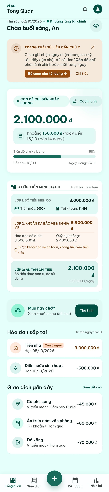
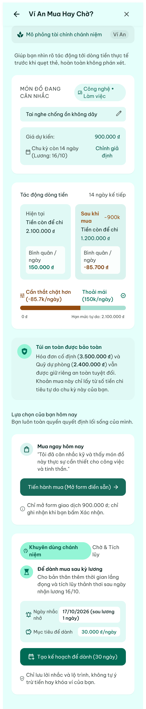
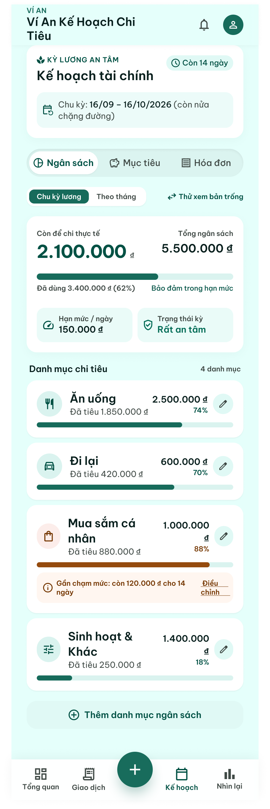
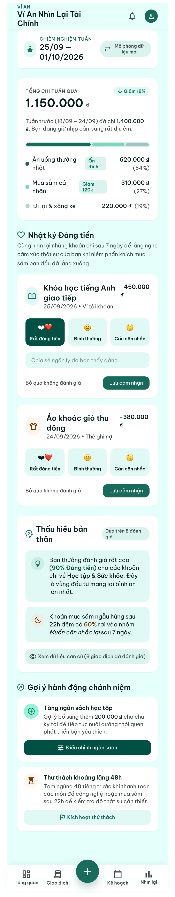
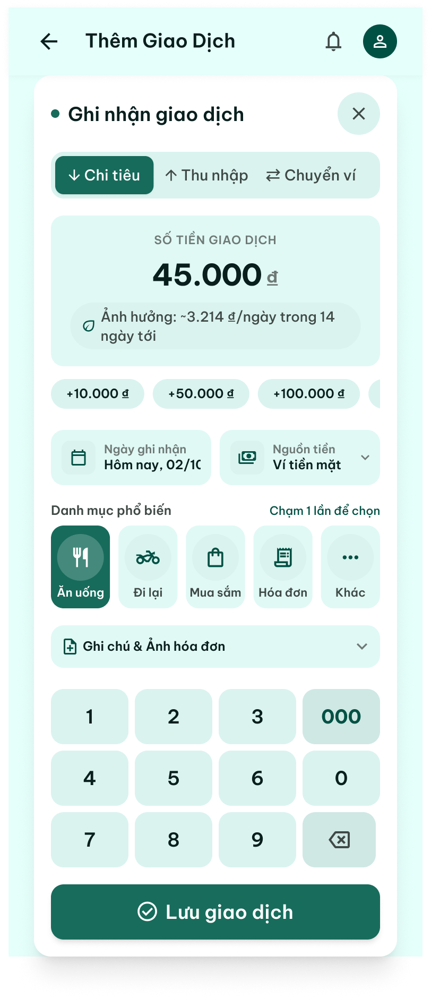
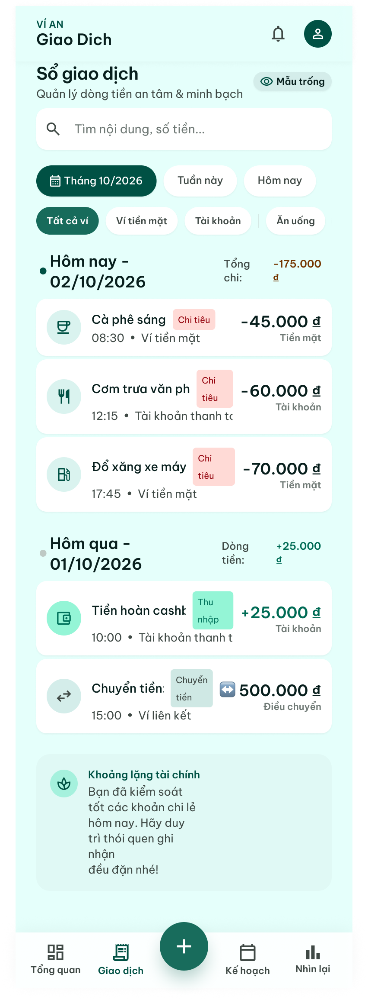

# 📱 Figma Design - App Quản Lý Chi Tiêu Ví An

> Link Figma: https://www.figma.com/design/zMJHtug5AfadTjRuuMYJ4M/APP

---

## 🎨 Tất cả màn hình

### 1. Ví An Logo (Splash Screen)

### 2. Ví An - Tổng Quan (Home/Dashboard)

### 3. Ví An - Mua Hàng Chi? (Add Transaction)

### 4. Ví An - Kế Hoạch Chi Tiêu (Budget Planning)

### 5. Ví An - Nhìn Lại — Nhật Ký Dùng Tiền (Transaction History)

### 6. Ví An - Thêm Giao Dịch (Transaction Detail)

### 7. Ví An - Lịch Sử Giao Dịch (Reports/Analytics)

---

## 📝 Ghi chú

- File này dùng để lưu tất cả màn hình từ Figma
- Sau khi có đủ ảnh, chúng ta sẽ phân chia công việc
- Format: PNG, độ phân giải tối thiểu 2x
